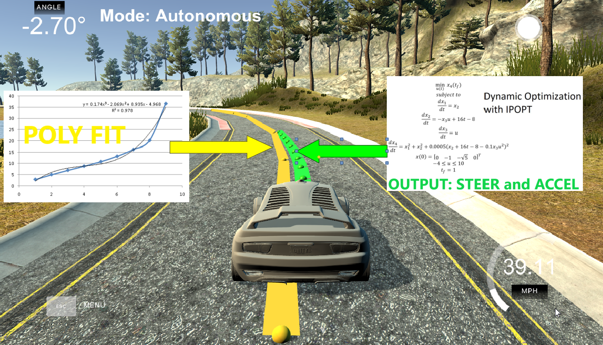

# **Self-Driving Car Engineer Nanodegree** #

# **Term2 – Project5: Model Predictive Control (MPC)** #

## **INTRODUCTION** ##

The purpose of the project is to implement Model Predictive Control
(MPC) for UDACITY’s car simulator. The path waypoints are given by the
simulator depending on the location of the vehicle and there is 100msec
latency between actuation commands (besides connection latency).

## **Model Predictive Control (MPC)** ##

MPC is an optimization problem, for this project solves the optimal
trajectory. It involves simulating different actuator inputs to predict
the resulting trajectory and then selects the one with minimum cost. The
advantage of MPC over PID is that it can deal with latency much more
effectively, by considering explicitly the latency.

For example, on this project we know the current state and reference
trajectory we want to follow. We then optimize the actuators at each
step in time in order to minimize the cost of the predicted trajectory.
Once we’ve found the lowest cost trajectory, we implement the very first
set of actuation commands. The rest of the actuation set is thrown away.
Take the new state and use it to calculate a new optimal trajectory
again. The solver used is IPOPT.

## **MPC implementation ** ##

1-The simulator gives us the current state of the vehicle:

**x, y, psi, speed**

2-The simulator passes the reference trajectory that we need to follow
as a series of way points. The points are transformed into the car’s
coordinate system:

ptsx\_car\[i\] = x \* cos(-psi) - y \* sin(-psi)

ptsy\_car\[i\] = x \* sin(-psi) + y \* cos(-psi)

A third order polynomial fit is done:

auto coeffs = polyfit(ptsx\_car, ptsy\_car, 3)

3-After receiving the data from the simulator, it is transformed w.r.t.
the vehicle’s C.S. Therefore at “time” t=0 we have (position x, position
y, orientation, cross track error, orientation error):

px = py = psi = 0

cte = desired\_y - actual\_y = polyeval(coeffs, px) - py =
polyeval(coeffs, 0)

epsi =actual psi-des.
psi=psi-atan(3\*coeff\[3\]\*px\*px+2\*coeff\[2\]\*px+coeff\[1\])=-atan(coeffs\[1\])

A kinematic vehicle model is used to run the model for latency
dt=100msec. This is the new initial state for MPC:

> px = px + v \* cos(psi) \* dt
>
> py = py + v \* sin(psi) \* dt
>
> psi = psi + v \* (-delta) / Lf \* dt
>
> epsi = epsi + psi
>
> cte = cte + v \* sin(epsi) \* dt
>
> v = v + a \* dt

4-The new state is passed to the MPC class which solves for the steering
and throttle actuators

sol = mpc.Solve(state,coeffs)

## **FG\_eval class ** ##

Defined in MPC.cpp, builds the vector ‘fg’ with the cost constraints. It
uses the equations of motion, the polynomial fit coefficients, and the
desired constraints.

For the optimization solver, the variable to ***minimize*** is stored on
fg\[0\]:

CTE EPSI velocity squared error

fg\[0\] += 1 \* CppAD::pow(vars\[cte\_start + t\], 2)

fg\[0\] += 1 \* CppAD::pow(vars\[epsi\_start + t\], 2)

fg\[0\] += 1 \* CppAD::pow(vars\[v\_start + t\] - ref\_v, 2)

actuator variables squared error

fg\[0\] += 1 \* CppAD::pow(vars\[delta\_start + t\], 2)

fg\[0\] += 1 \* CppAD::pow(vars\[a\_start + t\], 2)

steer and accel rate squared error

fg\[0\] += 500 \* CppAD::pow(vars\[delta\_start + t + 1\] -
vars\[delta\_start + t\], 2)

fg\[0\] += 1 \* CppAD::pow(vars\[a\_start + t + 1\] - vars\[a\_start +
t\], 2)

All the remaining constraints are:

Initial constraints

fg\[1 + x\_start\] = vars\[x\_start\]

fg\[1 + y\_start\] = vars\[y\_start\]

fg\[1 + psi\_start\] = vars\[psi\_start\]

fg\[1 + v\_start\] = vars\[v\_start\]

fg\[1 + cte\_start\] = vars\[cte\_start\]

fg\[1 + epsi\_start\] = vars\[epsi\_start\]

Kinematic Model Equations of Motion , CTE and EPSI

fg\[1 + x\_start + t\] = x1 - (x0 + v0 \* CppAD::cos(psi0) \* dt)

fg\[1 + y\_start + t\] = y1 - (y0 + v0 \* CppAD::sin(psi0) \* dt)

fg\[1 + psi\_start + t\] = psi1 - (psi0 + v0 \* delta0 / Lf \* dt)

fg\[1 + v\_start + t\] = v1 - (v0 + a0 \* dt)

fg\[1 + cte\_start + t\] = cte1 - ((f0 - y0) + (v0 \* CppAD::sin(epsi0)
\* dt))

fg\[1 + epsi\_start + t\] = epsi1 - ((psi0 - psides0) + v0 \* delta0 /
Lf \* dt)

## **MPC::solve method ** ##

Defined in MPC.cpp. Defines the initial variables, lower/upper bounds
for vars and constraints.

Vector ‘vars’ for state and actuator variables:

// Initial value of the independent variables. SHOULD BE 0 besides
initial state.

> for (int i = 0; i &lt; n\_vars; i++) {
>
> vars\[i\] = 0.0; }

// Set the initial variable values

> vars\[x\_start\] = x
>
> vars\[y\_start\] = y
>
> vars\[psi\_start\] = psi
>
> vars\[v\_start\] = v
>
> vars\[cte\_start\] = cte
>
> vars\[epsi\_start\] = epsi

Vars lower and upper bounds:

Set all non-actuators upper and lowerlimits to the max neg and pos
values

> vars\_lowerbound\[i\] = -1.0e19
>
> vars\_upperbound\[i\] = +1.0e19

The upper and lower limits of delta are set to -25 and 25 deg (values in
radians)

> vars\_lowerbound\[i\] = -0.436332
>
> vars\_upperbound\[i\] = +0.436332

Acceleration/decceleration upper and lower limits

> vars\_lowerbound\[i\] = -1.0
>
> vars\_upperbound\[i\] = +1.0

Constraints lower and upper bounds:

all Lower and upper limits for constraints ARE 0 (besides initial state)

> constraints\_lowerbound\[i\] = 0
>
> constraints\_upperbound\[i\] = 0

LOWER BOUND Initial state ( not zero )

> constraints\_lowerbound\[x\_start\] = x
>
> constraints\_lowerbound\[y\_start\] = y
>
> constraints\_lowerbound\[psi\_start\] = psi
>
> constraints\_lowerbound\[v\_start\] = v
>
> constraints\_lowerbound\[cte\_start\] = cte
>
> constraints\_lowerbound\[epsi\_start\] = epsi

UPPER BOUND Initial state ( not zero )

> constraints\_upperbound\[x\_start\] = x
>
> constraints\_upperbound\[y\_start\] = y
>
> constraints\_upperbound\[psi\_start\] = psi
>
> constraints\_upperbound\[v\_start\] = v
>
> constraints\_upperbound\[cte\_start\] = cte
>
> constraints\_upperbound\[epsi\_start\] = epsi

Call for the FG\_eval class and performs the optimization for the new
set of actuator constraints:

> FG\_eval fg\_eval(coeffs);
>
> CppAD::ipopt::solve&lt;Dvector, FG\_eval&gt;(options, vars,
>
> vars\_lowerbound, vars\_upperbound,
>
> constraints\_lowerbound, constraints\_upperbound,
>
> fg\_eval,
>
> **solution**);

## **TIMESTEP LENGTH(N) AND ELAPSED DURATION BETWEEN TIMESTEPS(dT)** ##

Smaller Dt is better, because it gives more accuracy to the simulation.

Larger N is not necessarily better, because it can lead to more
computational time.

A large time horizon N\*dT can lead to a very long path to track that
may extend beyond the 3^rd^ order polynomial assumption for a typical
lookahead distance. This quantity should proportional to the speed of
the car.

For the 40MPH case, N=10 and Dt=0.05sec was sufficient enough for the
simulation.

## **PUTTING IT ALL TOGETHER IN A FLOWCHART** ##

## **CONCLUSIONS** ##

-   The MPC was implemented for going around the track at a speed of
    40MPH. The only constraint weight that was changed was the steer
    rate weight, which was set to 500. Also the time horizon was set to
    10x0.05secs. The car was able to go around the track indefinitely.

-   For other speeds, the constraint weights and time horizon variables
    would have to be adjuster..

-   Also, for other speeds the latency delay could be different. For
    example, for tires, relaxation length (and the time to achieve it)
    reduces as the driving speed increases.

